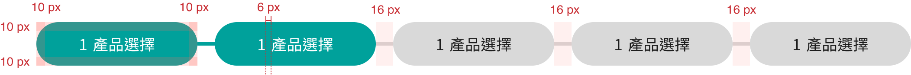
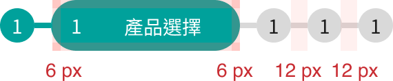

# Steps 步驟表示
>分步式操作指引，幫助使用者在介面中完成特定流程。它通常以清晰的步驟呈現，搭配視覺提示，讓使用者快速理解並完成操作。
<script setup>
    import Steps from '../components/Steps.vue'
</script>
## 元件預覽
<Steps />

## 程式碼
::: code-group
```html [html]
<div class="l-steps">
  <ul class="l-stepsList">
    <li class="l-stepsName done">
      <div class="l-stepsNum">1</div>
      <div class="l-stepsTxt">產品選擇</div>
    </li>
    <li class="l-stepsName">
      <div class="l-stepsNum">2</div>
      <div class="l-stepsTxt">身分驗證</div>
    </li>
    <li class="l-stepsName todo">
      <div class="l-stepsNum">3</div>
      <div class="l-stepsTxt">資料填寫</div>
    </li>
    <li class="l-stepsName todo">
      <div class="l-stepsNum">4</div>
      <div class="l-stepsTxt">資料確認</div>
    </li>
  </ul>
</div>
```
```css [css]
.l-stepsList{
  position: relative;
  width: 100%;
  display: -webkit-box;
  display: -ms-flexbox;
  display: flex;
  -webkit-box-pack: center;
  -ms-flex-pack: center;
  justify-content: center;
  -webkit-box-align: center;
  -ms-flex-align: center;
  align-items: center;
  line-height: 21px;
}
.l-stepsList {
  list-style: none;
  display: -webkit-box;
  display: -ms-flexbox;
  display: flex;
  margin: 10px 0;
  padding: 0;
}
.l-stepsName {
  font-size: 14px;
  margin: 6px;
  padding: 6px;
  background-color: #00a19b;
  border-radius: 50px;
  color: #FFFFFF;
  text-align: center;
  position: relative;
  display: -webkit-box;
  display: -ms-flexbox;
  display: flex;
  -webkit-box-pack: center;
  -ms-flex-pack: center;
  justify-content: center;
  -webkit-box-align: center;
  -ms-flex-align: center;
  align-items: center;
  font-weight: bold;
}
.l-stepsName::after {
  content: "";
  width: 12px;
  height: 4px;
  position: absolute;
  background: #D9D9D9;
  margin: auto;
  top: 50%;
  -webkit-transform: translateY(-50%);
  transform: translateY(-50%);
  right: -12px;
}
.l-stepsName:last-child::after{
  display: none;
}
.l-stepsNum {
  display: -webkit-box;
  display: -ms-flexbox;
  display: flex;
  -webkit-box-align: center;
  -ms-flex-align: center;
  align-items: center;
  -webkit-box-pack: center;
  -ms-flex-pack: center;
  justify-content: center;
  margin: 0;
  border-radius: 100%;
  width: 25px;
  height: 25px;
  text-align: center;
  line-height: 22px;
  margin: 0;
}
.l-stepsTxt {
  width: 100px;
  vertical-align: middle;
  font-size: 14px;
  padding: 2px 0;
}
.todo {
  background: transparent;
  color: #1C1C1C;
  margin: 6px;
  padding: 0;
}
.todo .l-stepsNum{
  background-color: #D9D9D9;
}
.todo .l-stepsTxt, .done .l-stepsTxt{
  display: none;
}
.done{
  background: #00a19b;
  padding: 0;
}
.l-stepsName.done::after{
    background: #00a19b;
}
@media (min-width: 768px){
  .l-stepsList{
    line-height: 24px;
  }
  .l-stepsName{
    width: 130px;
    font-size: 16px;
    margin: 16px 4px;
  }
  .l-stepsNum {
    width: auto;
    height: auto;
    text-align: center;
    line-height: 22px;
    margin-right: 6px;
}
  .l-stepsTxt{
    font-size: 16px;
    width: auto;
  }
  .l-stepsName::after{
    width: 16px;
    right: -16px;
  }
  .todo{
  background: #d9d9d9;
  padding: 6px;
  }
  .todo .l-stepsTxt, .done .l-stepsTxt{
    display: block;
  }
  .done{
    padding: 6px;
  }
}
@media (min-width: 992px){
    .l-stepsList{
    line-height: 27px;
  }
  .l-stepsName{
    width: 186px;
    margin: 16px 8px;
    font-size: 18px;
    padding: 10px;
  }
  .l-stepsTxt{
    font-size: 18px;
  }
}
```

## 元件規範
<div class="table-responsive">
    <table class="table table-bordered w1000">
        <thead class="bg-primary-8">
            <tr>
                <th scope="col"></th>
                <th scope="col" colspan="3">≤ 768px</th>
            </tr>
        </thead>
        <tbody>
            <tr>
                <td rowspan="3" class="bg-primary-2" scope="row">
                    <p class="text-gray-11">:defualt<br>:active</p>
                </td>
                <td style="padding: 20px;">
                    
                </td>
            </tr>
            <tr>
                <td>
                    <b>Default樣式</b><br>
                    <b>文字</b>
                    <ul class="pl-3 my-1">
                        <li>color:#1c1c1c</li>
                        <li>font-size:18px</li>
                    </ul>
                    <b>背景</b>
                    <ul class="pl-3 my-1">
                        <li>background-color:#d9d9d9</li>
                        <li>padding:6px</li>
                        <li>width:137px</li>
                        <li>height:37px</li>
                    </ul>
                </td>
            </tr>
            <tr>
                <td>
                    <b>Active樣式</b><br>
                    <b>文字</b>
                    <ul class="pl-3 my-1">
                        <li>color:#ffffff</li>
                    </ul>
                    <b>背景</b>
                    <ul class="pl-3 my-1">
                        <li>background-color:#00a19b</li>
                    </ul>
                </td>
            </tr>
        </tbody>
    </table>
</div>
<div class="table-responsive">
    <table class="table table-bordered w1000">
        <thead class="bg-primary-8">
            <tr>
                <th scope="col"></th>
                <th scope="col" colspan="3">> 768px</th>
            </tr>
        </thead>
        <tbody>
            <tr>
                <td rowspan="3" class="bg-primary-2" scope="row">
                    <p class="text-gray-11">:defualt<br>:active</p>
                </td>
                <td style="padding: 20px;">
                    
                </td>
            </tr>
            <tr>
                <td>
                    <b>Default樣式</b><br>
                    <b>文字</b>
                    <ul class="pl-3 my-1">
                        <li>color:#1c1c1c</li>
                        <li>font-size:18px</li>
                    </ul>
                    <b>背景</b>
                    <ul class="pl-3 my-1">
                        <li>background-color:#d9d9d9</li>
                        <li>padding:10px</li>
                        <li>width:186px</li>
                        <li>height:51px</li>
                    </ul>
                </td>
            </tr>
            <tr>
                <td>
                    <b>Active樣式</b><br>
                    <b>文字</b>
                    <ul class="pl-3 my-1">
                        <li>color:#ffffff</li>
                    </ul>
                    <b>背景</b>
                    <ul class="pl-3 my-1">
                        <li>background-color:#00a19b</li>
                    </ul>
                </td>
            </tr>
        </tbody>
    </table>
</div>